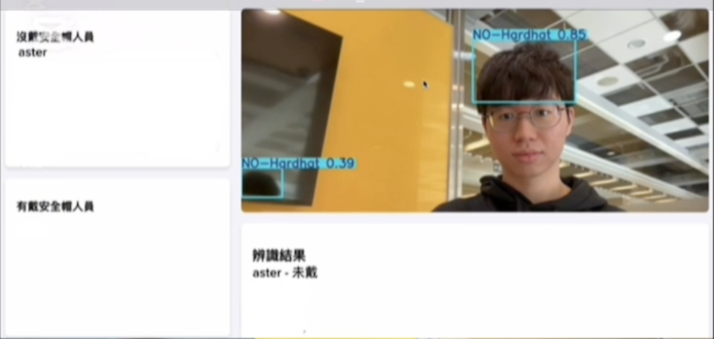
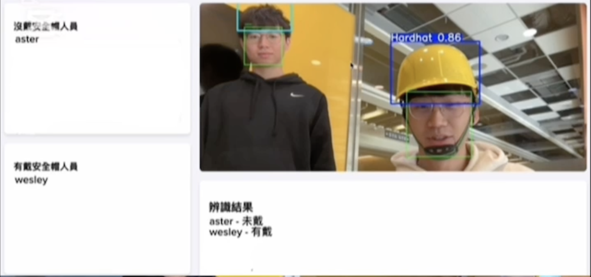
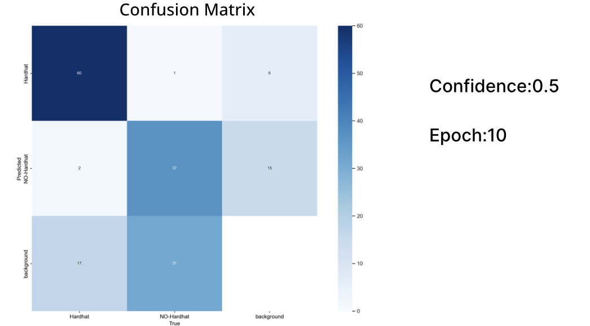
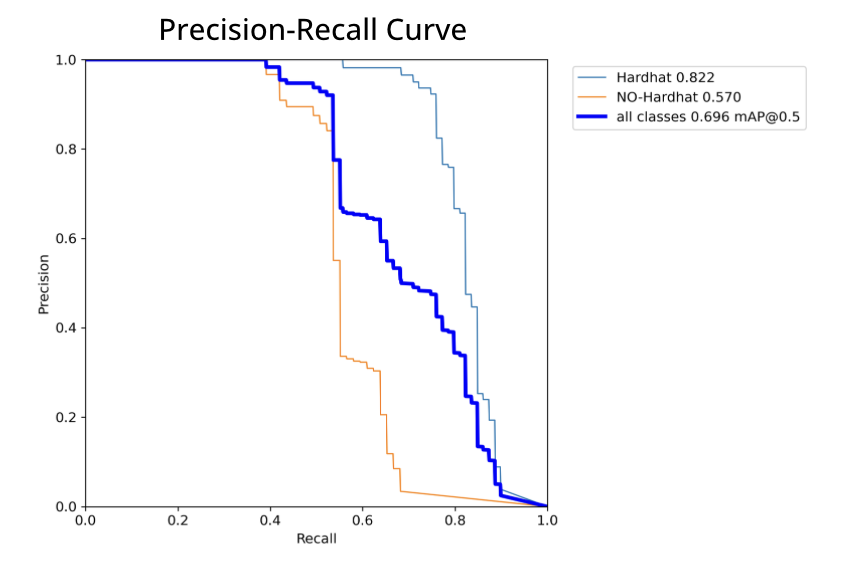
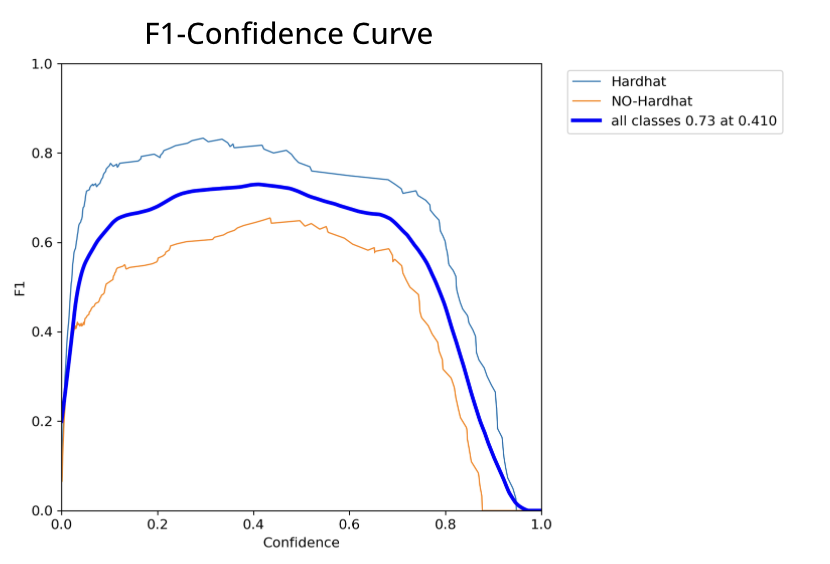
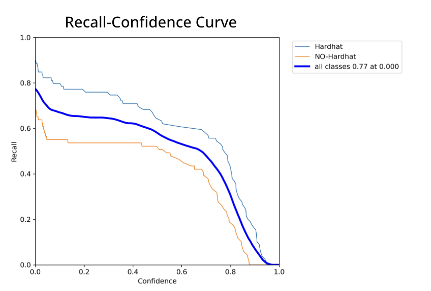

# Workplace Safety Monitoring System

A real-time workplace safety monitoring system that integrates **YOLOv8 object detection** and **face recognition** to identify personnel and determine whether they are wearing safety helmets. The system features a **Flask-based web dashboard**, real-time video feed, and **SQLite** database for logging personnel safety status.

## System Preview

- No Helmet Detected  
  

- Helmet Detected  
  

## Features

- **Live Video Detection**
  - Real-time detection using YOLOv8 (`best.pt`)
  - Safety helmet recognition
  - Face recognition against known personnel

- **Face Recognition Integration**
  - Automatically uploads recognized personnel from `known_faces/`
  - Uses `face_recognition` library for encoding and matching

- **Personnel Database**
  - Logs name, arrival time, and helmet status
  - Stored via SQLite (`site.db`)

- **RESTful API**
  - `GET /api/personnel` – Retrieve personnel safety info
  - `POST /api/upload_face` – Upload new face record
  - `POST /api/update_helmet` – Update helmet status

- **Responsive Web Interface**
  - Displays live feed and recognition results
  - Dynamic lists of personnel with or without helmets
  - Real-time updates via Server-Sent Events

## Project Structure

| File / Folder       | Description                                      |
|---------------------|--------------------------------------------------|
| `app.py`            | Main Flask backend with API endpoints and UI     |
| `best.pt`           | YOLOv8 model for helmet detection                |
| `known_faces/`      | Local dataset of face images                     |
| `images/`           | System preview images                            |
| `requirements.txt`  | Python dependencies                              |
| `site.db`           | Auto-generated SQLite database                   |

## Model Performance

The YOLOv8 model was trained for 10 epochs with a confidence threshold of 0.5. Below are the evaluation metrics demonstrating the model's detection performance:

### Confusion Matrix

The confusion matrix shows the classification performance across three categories: **Hardhat**, **NO-Hardhat**, and **background**. The model achieves strong true positive rates, with 60 correct detections for helmeted personnel and 37 for non-helmeted cases. Misclassifications between helmet and no-helmet classes remain minimal, indicating reliable safety status recognition.

### Precision-Recall Curve

This curve illustrates the trade-off between precision and recall at various confidence thresholds. The **Hardhat** class achieves an impressive mAP@0.5 of **0.822**, while the **NO-Hardhat** class reaches **0.570**. The overall system mAP across all classes is **0.696**, demonstrating balanced detection capabilities for both safety compliance and violation scenarios.

### F1-Confidence Curve

The F1-Confidence curve shows the optimal balance between precision and recall. Peak F1 scores occur around confidence levels of 0.2-0.4, with the **Hardhat** class maintaining consistently higher F1 scores (peaking above 0.8) compared to **NO-Hardhat** (peaking around 0.65). The all-classes F1 score of **0.73 at confidence 0.410** indicates the recommended operating threshold for balanced performance.

### Recall-Confidence Curve

This curve demonstrates how recall varies with detection confidence. At lower confidence thresholds (near 0), the system achieves high recall rates (above 0.75), capturing most helmet and non-helmet instances. The **Hardhat** class maintains better recall across all confidence levels compared to **NO-Hardhat**, with the all-classes recall of **0.77 at confidence 0.000** showing the model's comprehensive detection capability.

## Web Dashboard Preview

The dashboard provides categorized lists of recognized personnel with or without helmets, a real-time video feed, and live recognition updates.

- **Helmeted Personnel**
- **Non-Helmeted Personnel**
- **Live Recognition List**

## Technologies Used

- Python
- Flask – Web server & API
- YOLOv8 – Helmet detection
- face_recognition – Personnel identity recognition
- SQLite – Lightweight database
- HTML/CSS/JS – Custom UI dashboard

## Live System Workflow

1. Capture frame from camera.
2. Run face recognition and helmet detection.
3. Match faces with local dataset in `known_faces/`.
4. Update server via REST APIs.
5. Show results on the web dashboard.
